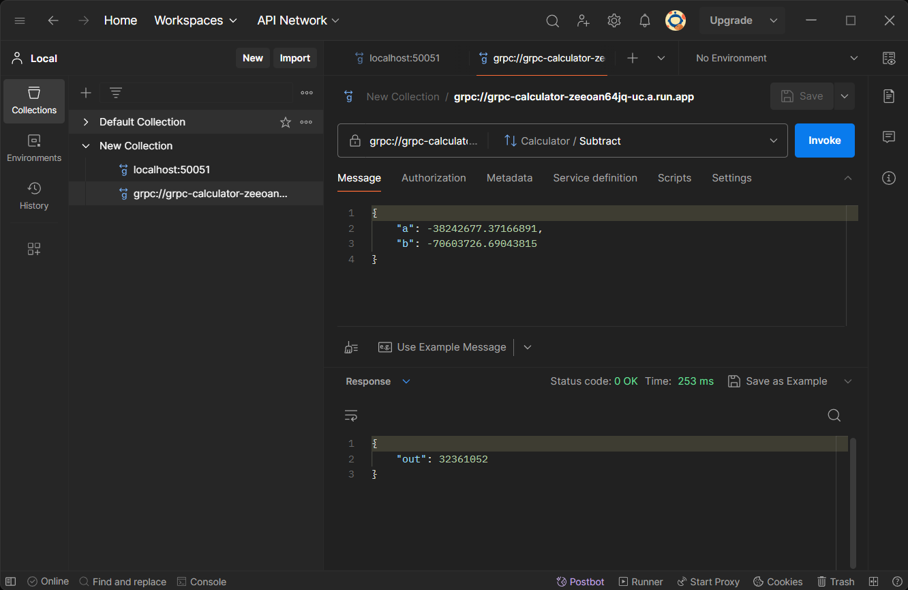

# grpc-calculator

A basic grpc based calculator

## Example in Postman


## Run on Google Cloud Run
```bash
gcloud run deploy --image docker.io/blurrycontour/grpc-calculator:latest --platform managed --port 50051
```

## Build
```bash
# Use these commands for easy life
make clean
make
# Docker commands
make build
make run
make push
```

## Deploy
Locally
```bash
docker run -d -p 443:50051 --name grpc-calculator blurrycontour/grpc-calculator:latest
```
Over SSH
```bash
APP_NAME=grpc-calculator
SSH_IP=34.171.145.25
SSH_USER=yujiro

ssh -i ~/.ssh/id_gcp $SSH_USER@$SSH_IP "docker ps -q --filter 'name=$APP_NAME' | xargs -r docker stop"
ssh -i ~/.ssh/id_gcp $SSH_USER@$SSH_IP "docker ps -aq --filter 'name=$APP_NAME' | xargs -r docker rm"
ssh -i ~/.ssh/id_gcp $SSH_USER@$SSH_IP "docker pull blurrycontour/grpc-calculator:latest"
ssh -i ~/.ssh/id_gcp $SSH_USER@$SSH_IP "docker run -d -p 443:50051 --name $APP_NAME blurrycontour/grpc-calculator:latest"
```

## Load Testing
Locally
```bash
docker run --rm -it --entrypoint sh fullstorydev/grpcurl:latest-alpine -c "while true; do grpcurl -plaintext -d '{\"a\":1, \"b\":2}' localhost:50051 calculator.Calculator/Add; sleep 0; done"
```
Over SSH
```bash
LOAD_NAME=load-tester
SSH_IP=34.171.145.25
SSH_USER=yujiro

ssh -i ~/.ssh/id_gcp $SSH_USER@$SSH_IP "docker ps -q --filter 'name=$LOAD_NAME' | xargs -r docker stop"
ssh -i ~/.ssh/id_gcp $SSH_USER@$SSH_IP "docker ps -aq --filter 'name=$LOAD_NAME' | xargs -r docker rm"
ssh -i ~/.ssh/id_gcp $SSH_USER@$SSH_IP "docker run -d --name $LOAD_NAME --entrypoint sh fullstorydev/grpcurl:latest-alpine -c \"while true; do grpcurl -plaintext -d '{\\\"a\\\":1, \\\"b\\\":2}' $SSH_IP:443 calculator.Calculator/Add; sleep 0; done\""
```

##
